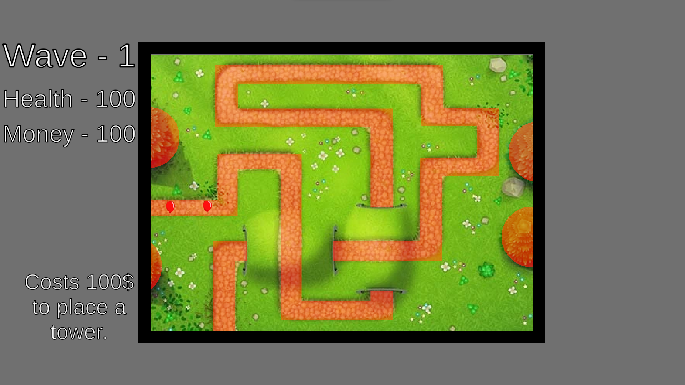
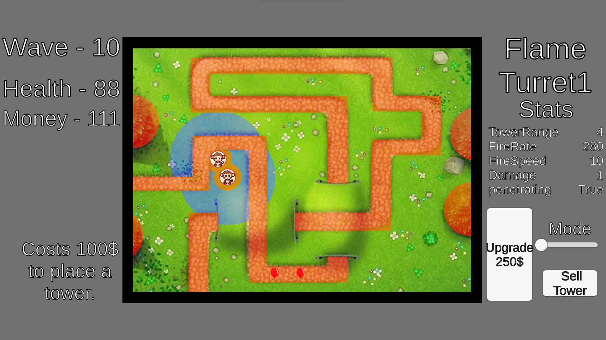
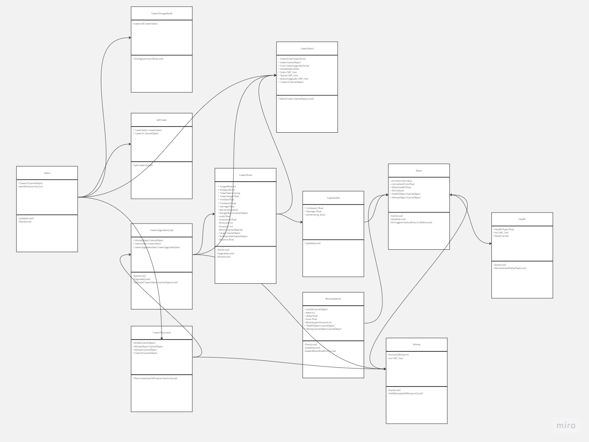

# TowerDefense

In deze tower defense-game plaatsen spelers strategisch torens om waves van vijanden te verslaan en munten te verdienen. Het spel bevat een progressief wavesysteem en een health systeem. Spelers kunnen torens upgraden en hebben flexibele plaatsingsmogelijkheden, behalve op obstakels zoals bomen, paden en andere torens, waardoor de replaywaarde wordt verhoogd.

## Product 1: "DRY SRP Scripts op GitHub"

*"In dit script heb ik een json gebruikt voor al mijn tower upgrades. Hierdoor heb ik mijzelf niet hoeven herhalen **(DRY)** in de code omdat ik gemakelijk de upgrades can verandere in de json file.
[script](TowerDef/Assets/Scripts/Tower/TowerUpgradesScript.cs)"*

## Product 2: "Projectmappen op GitHub"

Dit is de [ROOT](/TowerDef/Assets) folder van mijn unity project.

## Product 3: Build op Github

[Release](https://github.com/Funadama/TowerDef/releases/tag/Release)

## Product 4: Game met Sprites(animations) en Textures 

De build van je game bevat textures, sprites en sprite animations(bijv particles) die op de juiste manier zijn gebruikt en zorgen voor een goede afwerking van je game.  

Plaats in je readme een animated gif van je gameplay (+- 10 sec.) waarin de implementatie van je textures en sprites goed te zien is.

## Product 5: Issues met debug screenshots op GitHub 

[Hier de link naar mijn issues](https://github.com/Funadama/TowerDef/issues/2)

## Product 6: Game design met onderbouwing 

* **Torens en Schietbereik:**

De keuze voor torens met 360 graden zicht en de vrijheid om ze bijna overal te plaatsen verhoogt de strategische diepgang van het spel. Spelers kunnen torens plaatsen op strategische posities om optimaal gebruik te maken van hun aanpasbare schietbereik.

* **Voorspellend Torenspel:**

Torens kunnen Voorspellen waar de balonen zijn zodat het makelijker is voor de speler keuzens te maken over waar ze hun torens gaan plaatsen

* **Progressief Wave systeem:**

Een progressief Wave systeem brengt een uitdagingen met zich mee naarmate het spel vordert. Nieuwe Waves van vijanden worden geïntroduceerd onder specifieke voorwaarden, waardoor elke speelsessie uniek wordt en spelers betrokken blijven.

* **Heatlh systeem:**

Spelers moeten hun verdediging goed beheren om te voorkomen dat vijanden met succes hun doel bereiken. Als dit gebeurt, verliezen ze levens, wat de spanning en motivatie verhoogt om de Bloons te verslaan zonder levens te verliezen.

* **Beloningssysteem:**

Verdien munten door Bloons te verslaan en Waves te voltooien. Deze munten kunnen worden gebruikt om torens te plaatsen en te upgraden.

* **Torens upgraden:**

Spelers kunnen torens verbeteren en aanpassen aan hun speelstijl en de huidige uitdagingen, waardoor de speelbaarheid wordt vergroot. Ze blijven streven naar de optimalisatie van hun verdediging.

* **Placement systeem:**

De player kunt hun torens bijna overal plaatsen zodat de replayability hoger is van het spel maar je kunt je torens niet plaatsen op bomen,paden,andere torens.

## Product 7: Class Diagram voor volledige codebase 

## Product 8: Prototype test video

## Product 9: SCRUM planning inschatting 

[Link naar de trello](https://trello.com/b/MSsn1uiA/towerdef)

## Product 10: Gitflow conventions

[gitflow](https://github.com/Funadama/TowerDef/tree/FeatureBranch)
